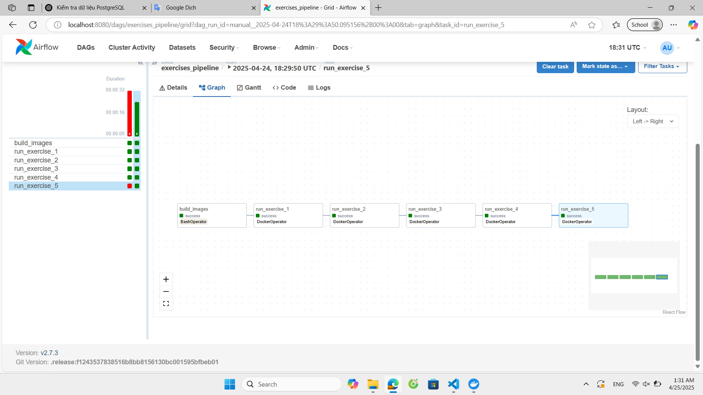
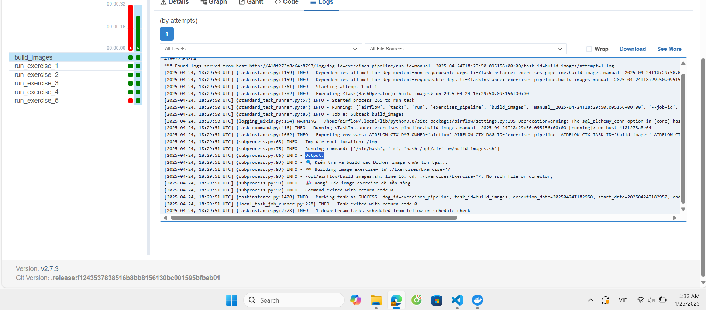
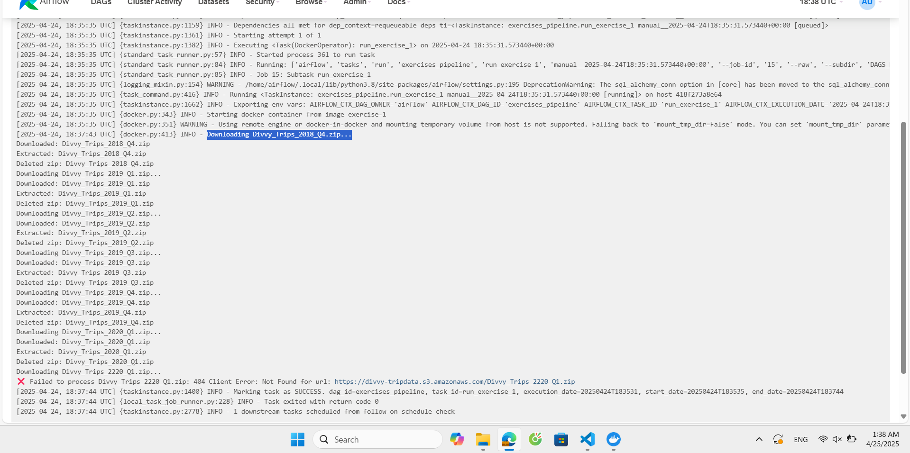
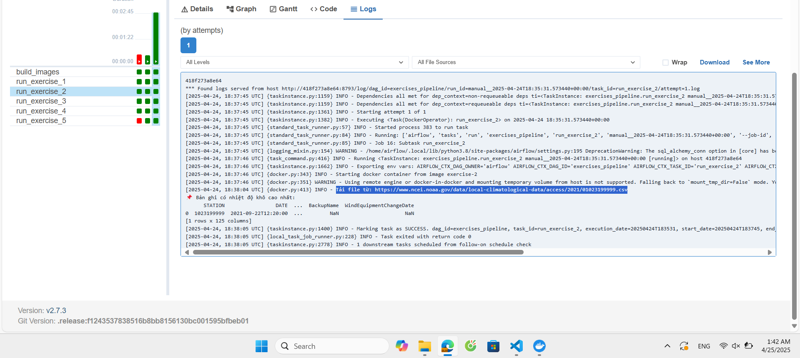
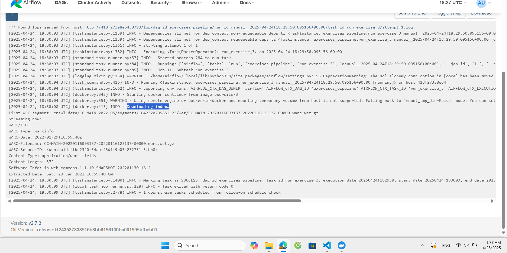
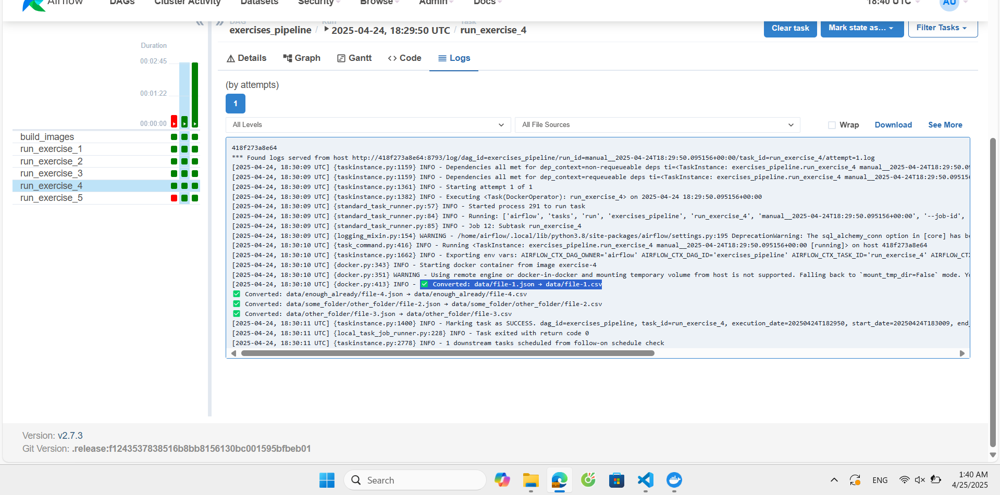
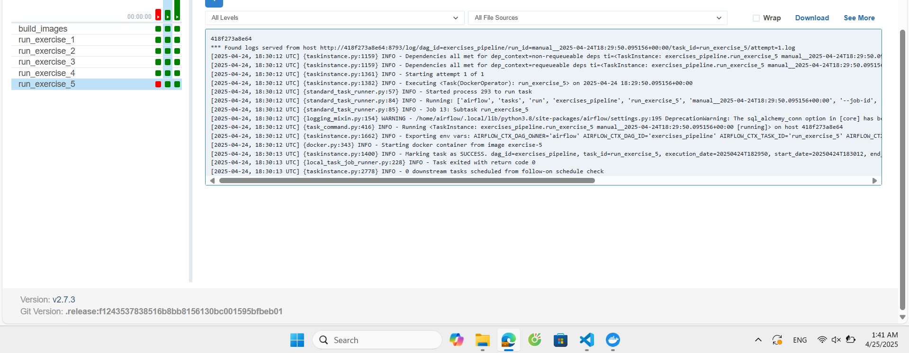

# Exercise-1:
**docker build --tag=exercise-1 .**

**docker-compose up run**

# Exercise-2:
**docker build --tag=exercise-2 .**
Trong requirements.txt, thêm: beautifulsoup4==4.12.3

**docker-compose up run**

# Exercise-3:
Không thể dùng boto3 vì Bucket public này không cho truy cập qua boto3 từ bên ngoài AWS, cần chuyển sang dùng request với 
URL: https://data.commoncrawl.org/

**docker build --tag=exercise-3 .**

**docker-compose up run**
Khi chạy sẽ hiển thị text liên tục, **CTRL + C** để dừng

# Exercise-4:
**Build và run**

# Exercise-5:
**Build và run với các lệnh như cũ**

**Kiểm tra**

# Pipeline:
**Kết quả: Thành công**

**Log Task 1**

**Log Task 2: Exercise 1**

**Log Task 3: Exercise 2**

**Log Task 4: Exercise 3**

**Log Task 5: Exercise 4**

**Log Task 6: Exercise 5 (task này không có output)**
