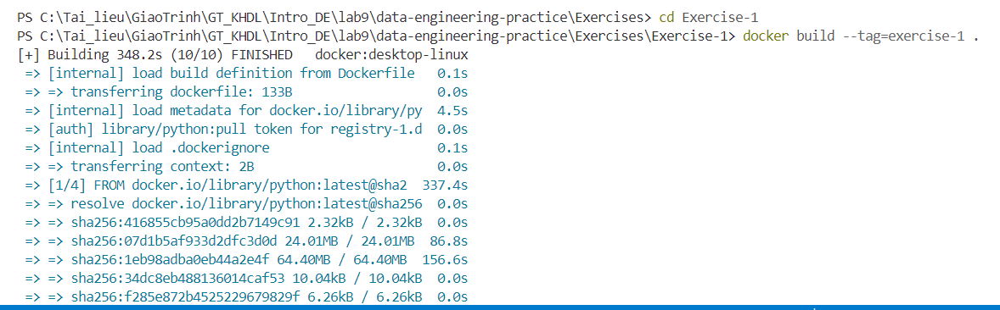
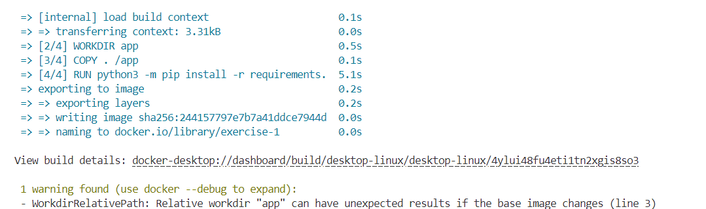
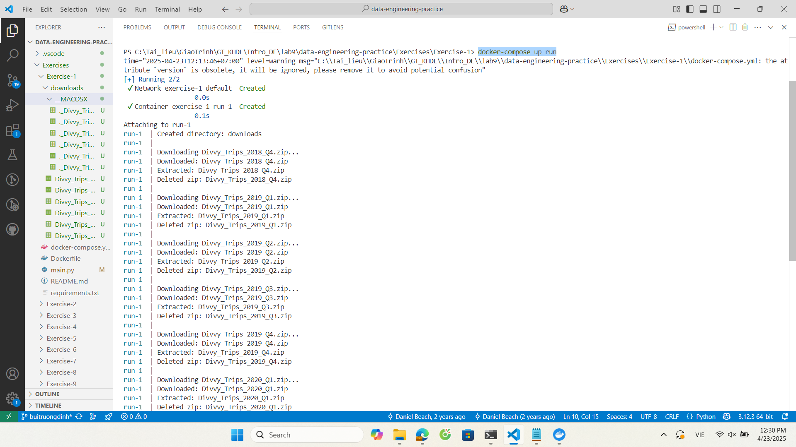
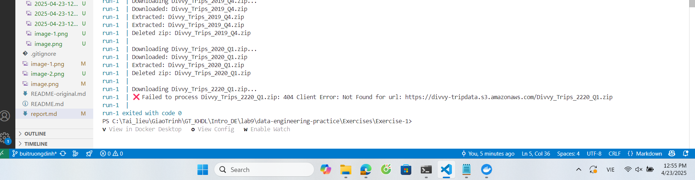
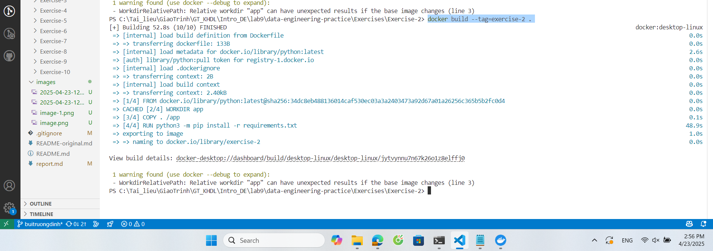
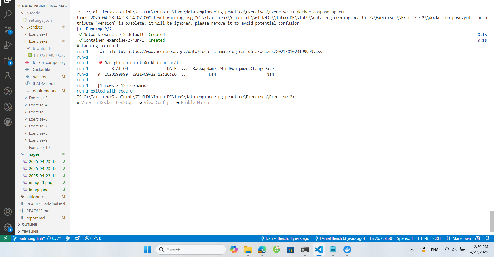
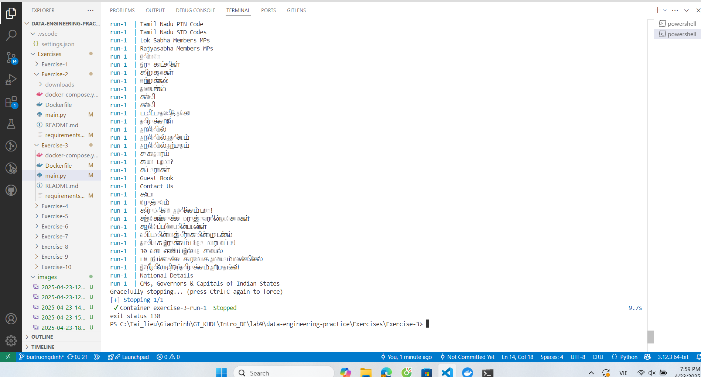
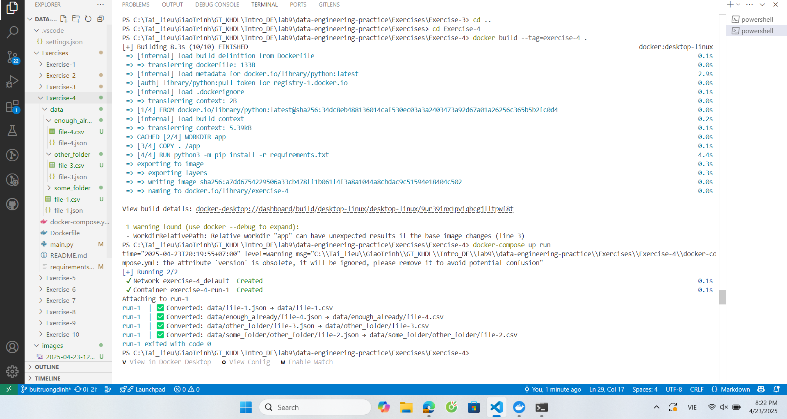
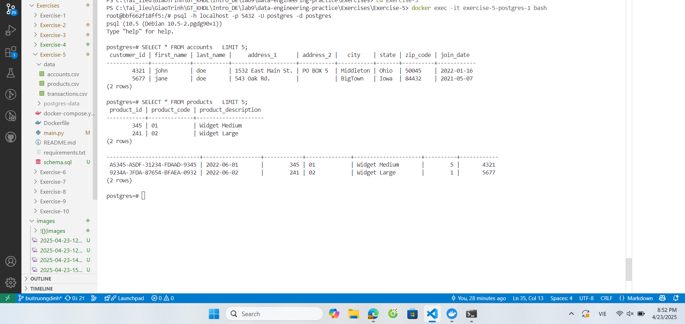

# Exercise-1:
**docker build --tag=exercise-1**

**docker-compose up run**

# Exercise-2:
**docker build --tag=exercise-2**
Trong requirements.txt, thêm: beautifulsoup4==4.12.3

**docker-compose up run**

# Exercise-3:
Không thể dùng boto3 vì Bucket public này không cho truy cập qua boto3 từ bên ngoài AWS, cần chuyển sang dùng request với 
URL: https://data.commoncrawl.org/

**docker build --tag=exercise-3**

**docker-compose up run**

# Exercise-4:
**Build và run**

# Exercise-5:
**Build và run với các lệnh như cũ**

**Kiểm tra**
